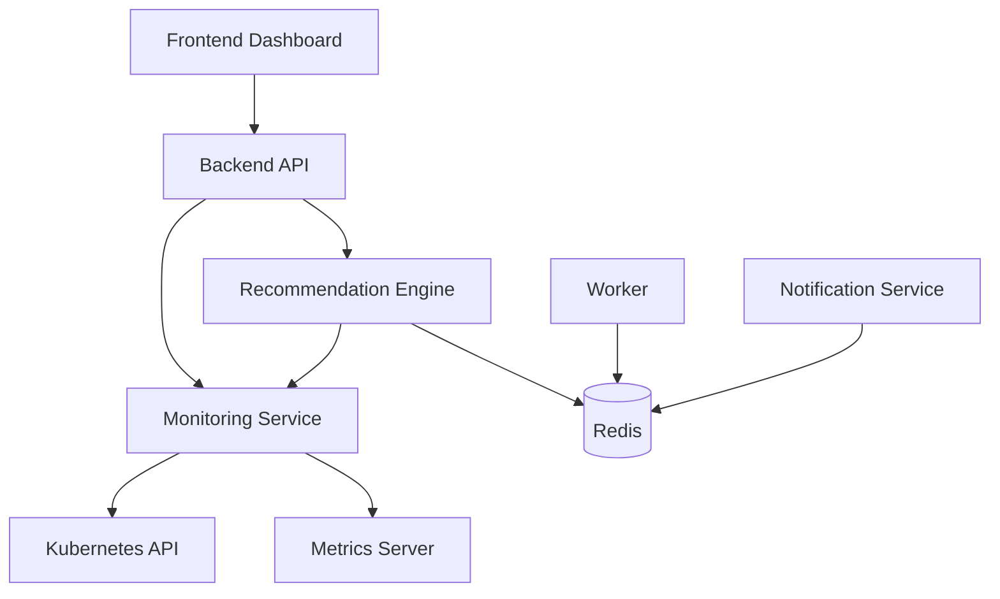

# Kubewise - AI Kubernetes Cost Optimization Platform

Kubewise is a lightweight AI-powered Kubernetes Cost Leakage Detection Platform built for hackathons.

It monitors real cluster metrics from Kubernetes API and Metrics Server, analyzes utilization versus configured requests and limits, and generates dynamic optimization recommendations.

## Architecture



## Services

- frontend: Nginx static operations dashboard.
- backend: FastAPI control plane and API gateway.
- monitoring-service: FastAPI service that collects live cluster data and metrics.
- recommendation-engine: FastAPI service that analyzes workloads and returns dynamic recommendations.
- worker: background CPU and Redis activity generator.
- notification-service: periodic Redis processing simulator.
- redis: data and event store.

## Project Structure

```text
kubewise/
├── frontend/
├── backend/
├── monitoring-service/
├── recommendation-engine/
├── worker/
├── notification-service/
├── k8s/
└── README.md
```

## Backend API Endpoints

- GET /health
- GET /metrics
	- uptimeSeconds
	- requestsProcessed
	- redisStatus
	- loadGenerationCount
	- applicationVersion
- POST /generate-load
- POST /stress?duration=90
- GET /redis
- GET /summary
- GET /deployments
- GET /pods
- GET /recommendations

## Monitoring Service Endpoints

- GET /health
- GET /nodes
- GET /pods
- GET /deployments
- GET /metrics
- GET /summary

## Recommendation Engine Endpoints

- GET /health
- GET /recommendations

Recommendations are generated from live workload and metrics payloads, not hardcoded service lists.

## Prerequisites

- Docker 24+
- kubectl
- AWS CLI configured for EKS access
- EKS cluster with NGINX Ingress Controller
- Metrics Server installed

## Build Commands

Run from repository root:

```bash
docker build -t kubewise/frontend:1.0.0 ./frontend
docker build -t kubewise/backend:2.0.0 ./backend
docker build -t kubewise/monitoring-service:1.0.0 ./monitoring-service
docker build -t kubewise/recommendation-engine:1.0.0 ./recommendation-engine
docker build -t kubewise/worker:1.0.0 ./worker
docker build -t kubewise/notification:1.0.0 ./notification-service
```

## Push Commands (Docker Hub)

```bash
docker push kubewise/frontend:1.0.0
docker push kubewise/backend:2.0.0
docker push kubewise/monitoring-service:1.0.0
docker push kubewise/recommendation-engine:1.0.0
docker push kubewise/worker:1.0.0
docker push kubewise/notification:1.0.0
```

## Push Commands (Amazon ECR)

Set environment variables and push without editing command placeholders:

```bash
export AWS_ACCOUNT_ID=123456789012
export AWS_REGION=ap-south-1
export ECR_REGISTRY=${AWS_ACCOUNT_ID}.dkr.ecr.${AWS_REGION}.amazonaws.com

aws ecr get-login-password --region ${AWS_REGION} | docker login --username AWS --password-stdin ${ECR_REGISTRY}

docker tag kubewise/frontend:1.0.0 ${ECR_REGISTRY}/kubewise/frontend:1.0.0
docker tag kubewise/backend:2.0.0 ${ECR_REGISTRY}/kubewise/backend:2.0.0
docker tag kubewise/monitoring-service:1.0.0 ${ECR_REGISTRY}/kubewise/monitoring-service:1.0.0
docker tag kubewise/recommendation-engine:1.0.0 ${ECR_REGISTRY}/kubewise/recommendation-engine:1.0.0
docker tag kubewise/worker:1.0.0 ${ECR_REGISTRY}/kubewise/worker:1.0.0
docker tag kubewise/notification:1.0.0 ${ECR_REGISTRY}/kubewise/notification:1.0.0

docker push ${ECR_REGISTRY}/kubewise/frontend:1.0.0
docker push ${ECR_REGISTRY}/kubewise/backend:2.0.0
docker push ${ECR_REGISTRY}/kubewise/monitoring-service:1.0.0
docker push ${ECR_REGISTRY}/kubewise/recommendation-engine:1.0.0
docker push ${ECR_REGISTRY}/kubewise/worker:1.0.0
docker push ${ECR_REGISTRY}/kubewise/notification:1.0.0
```

Update image names in k8s manifests if you use private registry paths.

## Kubernetes Deployment Commands

```bash
kubectl apply -f k8s/namespace.yaml
kubectl apply -f k8s/redis.yaml
kubectl apply -f k8s/monitoring.yaml
kubectl apply -f k8s/recommendation.yaml
kubectl apply -f k8s/backend.yaml
kubectl apply -f k8s/frontend.yaml
kubectl apply -f k8s/worker.yaml
kubectl apply -f k8s/notification.yaml
kubectl apply -f k8s/ingress.yaml
```

## Verification Commands

```bash
kubectl get all -n kubewise
kubectl get ingress -n kubewise
kubectl top pods -n kubewise
kubectl top nodes

kubectl logs deployment/monitoring-service -n kubewise --tail=150
kubectl logs deployment/recommendation-engine -n kubewise --tail=150
kubectl logs deployment/backend -n kubewise --tail=150
```

## Quick API Validation

Replace host with your ingress DNS name:

```bash
curl http://kubewise.example.com/health
curl http://kubewise.example.com/metrics
curl http://kubewise.example.com/summary
curl http://kubewise.example.com/deployments
curl http://kubewise.example.com/pods
curl http://kubewise.example.com/recommendations
curl -X POST http://kubewise.example.com/generate-load
curl -X POST http://kubewise.example.com/stress?duration=120
```

## Troubleshooting

### Monitoring service cannot read cluster data

- Check RBAC objects in k8s/monitoring.yaml.
- Verify metrics API availability:

```bash
kubectl get apiservice v1beta1.metrics.k8s.io
kubectl logs -n kube-system deployment/metrics-server --tail=100
```

### Recommendation engine returns empty list

- Verify monitoring service has pod and deployment metrics.
- Confirm monitoring service endpoints return payloads.

### Ingress not serving dashboard

```bash
kubectl describe ingress kubewise-ingress -n kubewise
kubectl get svc -n ingress-nginx
```

### Pod startup failures

```bash
kubectl get pods -n kubewise
kubectl describe pod -n kubewise <pod-name>
```

Inspect image pull credentials, probe events, and security context compatibility.
